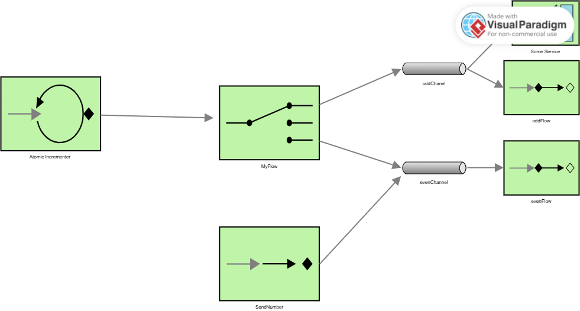

# Lab 5 Integration and SOA - Project Report

## 1. EIP Diagram (Before)

The initial code had several design issues and did not match the target diagram of the lab. The application generated numbers with an AtomicInteger, but there was no central channel that received all the messages. Instead, the flow sent the number directly to the router, completely bypassing the structure shown in the diagram.

Additionally, there was a misplaced PublishSubscribeChannel: the evenChannel was defined as publish-subscribe even though it only had one consumer, while oddChannel was treated as if it were pub/sub but it really wasn't. This caused inconsistent behaviors and made some messages be processed twice or get lost.

Another serious problem was that the gateway sent messages directly to the even channel, meaning all numbers sent by the scheduled task entered evenChannel without passing through the main flow or the router. This completely bypassed the even-odd selection logic. This meant that random negative numbers never reached oddChannel or the filter.

I also found a component that interfered with the flow: SomeService. This service had a @ServiceActivator listening to oddChannel, which meant it consumed messages directly from the channel before they entered the oddFlow. This parallel consumption turned the channel into a pipeline with two processes listening at the same time and caused some messages to never pass through the filter or the transform of the odd flow. This did not match the practice diagram, which required a single serial flow for odd numbers.

Additionally, the odd filter was poorly implemented: it accepted even numbers. Therefore, even numbers were processed within the odd flow, which completely broke the semantics of the flow and confused the log output.

---

## **2. Bugs Found**

### **Bug 1 — The odd filter was backwards**

The filter within oddFlow accepted even numbers instead of odd. This was simply an inverted condition. We corrected it so that it only accepted odd numbers to match the expected behavior of the channel.

### **Bug 2 — The gateway bypassed the flow**

The gateway sent all messages directly to evenChannel, bypassing the main flow and avoiding going through the router. This caused the numbers generated by the scheduled task to never be processed correctly. We corrected it by changing the gateway channel to numberChannel.

### **Bug 3 — The central channel was missing from the diagram**

The target diagram shows a central channel called numberChannel through which **all** numbers must pass before the router. In the starter code, this channel did not exist, and we had to create it and connect it properly to the polling flow and the gateway.

### **Bug 4 — oddChannel was not publish-subscribe**

The diagram required oddChannel to be a publish-subscribe channel, but in version 1 it was not defined as such and there were also two consumers listening to that channel, which broke the flow and caused non-deterministic behaviors. We fixed it by defining oddChannel as publish-subscribe and removing the extra ServiceActivator.

---

## **3. What I Have Learned**
Through this lab, I have learned to interpret an EIP diagram and correctly translate it into a flow in Spring Integration. I have better understood how channels work and the difference between a direct channel and a publish-subscribe channel. I have seen that if a gateway or a service activator points to the wrong channel, the entire flow breaks and inconsistent behaviors appear. I have also learned that the order of components matters a lot and that a single extra consumer can divert messages and break a pipeline that should be serial. I have better understood how routers, filters, and transformers work and how they relate to classic integration patterns.

## 4. AI Disclosure

**Did you use AI tools?** (ChatGPT, Copilot, Claude, etc.)

- If YES: Which tools? What did they help with? What did you do yourself?
- If NO: Write "No AI tools were used."

Yes, I used ChatGPT to help me with understanding some of the Enterprise Integration Patterns and to clarify certain concepts related to Spring Integration. The AI assisted me in formulating explanations and structuring my report. However, all the code modifications and the actual implementation were done by myself. 

---

## Additional Notes
